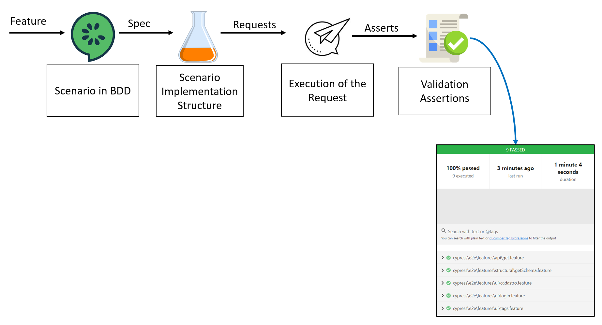

# Projeto de automação API adotando o framework Cypress com Cucumber
---

> Esse é um exemplo de como montar uma estrutura inicial de testes automáticos de API com o auxílio do [`Cypress.io`](https://github.com/cypress-io/cypress) e do [`cypress-cucumber-preprocessor`](https://github.com/badeball/cypress-cucumber-preprocessor) que dá suporte para a escrita dos cenários com as regras gramaticais do Gherkin e 
com o auxílio do [`cypress-plugin-api`](https://github.com/filiphric/cypress-plugin-api) para visualização das respostas.


## 📖 Sumário
---

1. [Pré-Requisitos](#pre-requisitos)
2. [Políticas de Testes](#politica-de-testes)
3. [Arquitetura do Projeto](#arquitetura-do-projeto)
4. [Camadas da Arquitetura](#camadas-da-arquitetura)
5. [Geração de Massas de Testes](#geracao-de-massas-de-testes)
6. [Relatório da Sprint](#relatorio-sprint)

### ✨ Pré-Requisitos
---

<a id="pre-requisitos"></a>

- A IDE escolhida foi o [`VS Code`](https://code.visualstudio.com/download);
- Instale o [`Node.js`](https://nodejs.org/en/download/);
- Seguindo as instruções da documentação do [`Cypress.io`](https://github.com/cypress-io/cypress), do [`cypress-cucumber-preprocessor`](https://github.com/badeball/cypress-cucumber-preprocessor) e do [`cypress-plugin-api`](https://github.com/filiphric/cypress-plugin-api) os instale;
- Baixe este repositório ou faça um git clone;
- Abra o diretório do projeto e execute o comando:
    - `npm install`
- Para acionar os testes em modo headless e cosntruir o relatório em ambiente Windowns, insira o arquivo `cucumber-json-formatter.exe` e execute no diretório do projeto:
    - `npm run run`
    - Para maiores detalhes, consutar: [`json-formatter`](https://github.com/cucumber/json-formatter) 
- Pronto, o projeto será executado em sua máquina e construirá o relatório. �

### 🪧 Políticas de Testes
---

<a id="politica-de-testes"></a>

> [!NOTE]
> A metodologia aqui descrita orienta uma abordagem de testes, mas não a limita, devendo ser revista e atualizada para endereçar o contexto particular de cada fase do projeto, cobrindo os processos de gerenciamento de teste e processos dinâmicos de teste.


- A abordagem principal se fundamenta nas práticas de Teste Ágil e Desenvolvimento orientado a Comportamento (BDD). A modelagem dos requisitos de qualidade do sistema será baseada na norma ISO/IEC/IEEE 29119. O esquema a seguir esquematiza o fluxo esquematizado para as atividades da arantia da Qualidade: 


### ⚙️ Arquitetura do Projeto
---

<a id="arquitetura-do-projeto"></a>

```
  ├─  cypress/
  │        │
  │        ├── e2e/
  │        │   ├── features/
  │        │   |   ├── api/
  │        │   |   |   ├── account/
  │        │   │   │   │   ├── alternativeFlow/
  │        │   │   │   │   |   └── get.features
  │        │   ├── step_test_definitions/
  │        │   |   ├── api/
  │        │   |   |   ├── account/
  │        │   │   │   │   ├── alternativeFlow/
  │        │   │   │   │   |   └── get.spec.js
  │        ├── fixtures/
  │        |   ├── userData/
  │        |   |   ├── dinamic/
  │        │   │   │   └── user.json
  │        ├── support/
  │        |   ├── api/
  │        |   |   ├── assertions/
  │        |   |   |   ├── account/
  │        │   │   │   |   ├── alternativeFlow/
  │        │   │   │   |   |   └── assertionsGet.js
  │        |   |   ├── requests/
  │        |   |   |   ├── account/
  │        │   │   │   |   ├── alternativeFlow/
  │        │   │   │   |   |   └── requestsGet.js
  │        |   ├── ui/
  │        |   |   ├── locators/
  │        |   |   |   ├── admin/
  │        │   │   │   |   └── admin_locators.js
  │        |   |   ├── pages/
  │        |   |   |   ├── admin/
  │        │   │   │   |   └── admin_pages.js
  │        |   ├── utils/
  │        |   |   |   ├── assertions/
  │        |   |   |   ├── commands/
  │        |   |   |   ├── environment/
  │        |   |   |   ├── users/
  │        |   |   |   └── config.js
  │        |   |   |   └── paths.json
  │        |   |   |   └── util.js
  │        |   |   └── e2e.js
  │        ├── modeling/
  │        |   ├── sprint/
  │        |   |   ├── back/
  │        |   |   |   ├── Service/
  │        |   |   |   |   └──seção/categoria.xmind
  │        |   |   ├── front/
  │        |   |   |   ├── Perfil/
  │        |   |   |   |   └──perfil.xmind
  │        |   |   ├── report/
  │        |   |   |   └──report-sprint.html
  ├── cypress.config.json
  ├── package.json
  └── README.md
```

## 🔍 Camadas da Arquitetura
---

<a id="camadas-da-arquitetura"></a>
> [!TIP]
> A arquitetura a seguir é apresentada com a seguinte diagramação



 - **assertions:** estratégia para executar as assertivas dos parametros retornados pela requisição;
 - **features:** arquivos contendo as definições de BDD em extensão *.feature;
 - **requests:** estratégia apra realização de requisições;
 - **step_definitions:** contém a junção entre a definição do BDD as chamdas dos requests e assertions para efetivação da validação
 - **commands:** Camada que inclui comandos personalizados do Cypress para otimizar a reutilização de código e melhorar a manutenção dos testes. Por exemplo, `generateUserDataAdmin` é um comando para criar dados fictícios para administradores e salvar esses dados em um arquivo de fixture.
 - **pages:** Classes que encapsulam métodos para interagir com a interface do usuário. Cada método reflete uma ação ou conjunto de ações que um usuário pode realizar em uma página, como acessar o site, navegar pelo menu lateral, ou alterar informações da conta.
 - **locators:** Objeto que contém seletores CSS ou XPath usados para localizar e interagir com elementos na página. Cada conjunto de locators é específico para uma função ou usuário, organizados por arquivos para facilitar a manutenção.
 - **fixtures:** Diretório onde as massas de teste são armazenadas. Pode ser dividido em 'dinamic', para dados que são gerados e possivelmente alterados em cada execução, e 'static', para dados que permanecem constantes e são reutilizados entre os testes. Esses dados são utilizados para alimentar os testes com informações necessárias para a execução dos cenários.

## 📝 Geração de Massas de Testes
---

<a id="geracao-de-massas-de-testes"></a>

- ##### Adotamos uma estratégia de geração de massas de testes para garantir que sempre tenhamos dados suficientes e variados para nossos testes.
> Embora este exemplo descreva a geração de massas para "admin", implementamos métodos semelhantes para outros tipos de usuários do sistema.

1. **Criação de Fixture:**
   Utilizamos o arquivo de fixture `userDataAdmin.json` para armazenar modelos de dados que simulam informações de administradores que podem ser usados nos testes. Este arquivo é dinamicamente gerado e armazenado no diretório `/cypress/fixtures/userData/dinamic`.

2. **Especificação de Testes (Spec):**
   No arquivo `gerarMassasAdmin.spec.js`, definimos os cenários de testes utilizando o BDD através do Cucumber. Especificamos a necessidade de gerar perfis de administradores chamando métodos específicos para a geração de dados.

3. **Utils Pages:**
   Dentro do arquivo `utilsPages.js`, implementamos o método `gerarMassasAdmin`, que é responsável por orquestrar a geração de dados, incluindo telefones, CPFs, CEPs, RGs, e CNPJs. Este método realiza a integração com diversas funções utilitárias para assegurar a criação de dados válidos e únicos para cada perfil.

4. **Comandos Customizados (Cypress Commands):**
   O arquivo `commands_admin.js` inclui o comando `generateUserDataAdmin`, que é chamado pelo método `gerarMassasAdmin`. Este comando utiliza a biblioteca Faker para gerar dados fictícios e salva o resultado final no arquivo de fixture `userDataAdmin.json`.

5. **Integração com Cypress Config:**
   No arquivo `cypress.config.js`, garantimos que todas as features relacionadas à geração de massas sejam executadas antes dos demais testes da automação. Isso é feito configurando o `specPattern` para priorizar essas features.

6. **Importação dos Commands:**
   No arquivo `e2e.js`, asseguramos que todos os Commands serão lidos. Isso é feito importando cada command implemenetado, da seguinte forma: `import './utils/commands/pasta_perfil/commands_perfil`


## 📊 Relatório da Sprint
---

<a id="relatorio-sprint"></a>

- ##### Ao fim de cada sprint, todos os teste são executados e um relatório é construído para auxiliar na interpretação da sanidade do projeto.
> O relatório não é carregado no ambiente do git, sendo necessário baaixar para suaa máquina e abrir em um browser.

# Relatório da execução

Para acessar o relatório, clique [aqui](report/index.html).